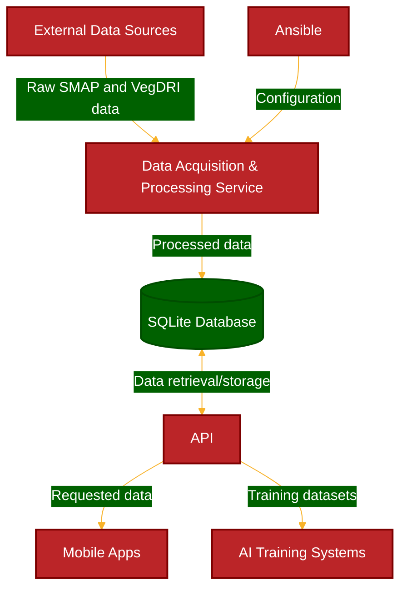

# openFlowServer
A backend server, designed around Raspberry Pi OS, for [OpenFlow](https://github.com/tmart234/openFlow): An API designed to deliver pre-processed NASA SMAP soil moisture data and USGS Vegdri data

